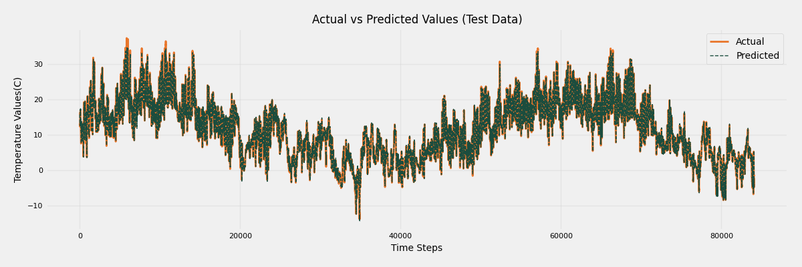

# 🌡️ Time Series Forecasting for Climate Data using LSTM

[](https://opensource.org/licenses/MIT)
[](https://www.python.org/downloads/)
[](https://www.tensorflow.org/)
[](https://github.com/psf/black)

An end-to-end machine learning project for temperature forecasting using LSTM networks.


<p align="center">
  
  
</p>


## 🔧 Tools Used

<p>

  
 


</p>


## 📦 Installation

### Prerequisites
- Python 3.8+
- pip


## 📂 Project Structure
```
project-root/
├── data/             
├── models/             
├── notebooks/
├── src/                
│   ├── data_processing.py
│   ├── features.py
│   ├── modeling.py
│   └── visualize.py
└── scripts/           
```


## 🧠 Model Architecture

```python
Sequential(
    LSTM(32, return_sequences=True, input_shape=(look_back, n_features)),
    Dropout(0.2),
    ReLU(),
    LSTM(32, return_sequences=False),
    Dropout(0.2),
    Dense(1)
)
```


## 📄 License
Distributed under the MIT License. See LICENSE for more information.

## 🙏 Acknowledgments
Jena Climate Dataset provided by Max Planck Institute


<!-- CONTACT -->
## **Contact**

##### Abenezer Tesfaye

⭐️ Email - tesfayeabenezer64@gmail.com
 
Project Link: [Github Repo](https://github.com/abu14/Climate-Temperature-Forecasting-LSTM)
